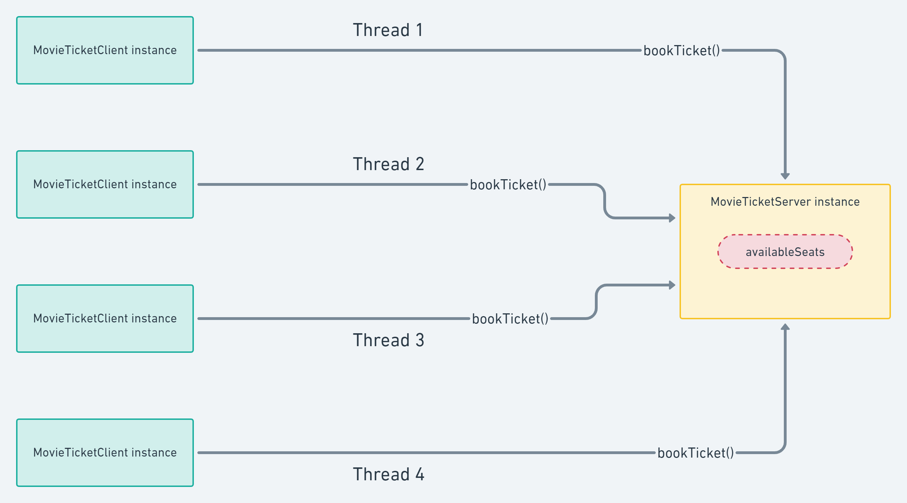

# Assignment 2

# Learning Objective

In this assignment we will learn about **thread Synchronization**. We will be building a movie ticket booking application (a really basic one) in order to demonstrate and understand the importance of thread synchronization.

# A bit of theory

Let’s start by asking ourselves why we need thread synchronization in the first place? Well when we work with process that can run in parallel (Thread A and Thread B for example) but use a shared resource (for instance, R), there are two problems that can happen:

1. Thread A is writing in R and Thread B tires reading it.
2. Thread A and Thread B both are trying to write in R.

Give the two cases a good thought as to why they are problematic cases.

Once you are convinced that the above two cases are indeed problems in multi-threaded scenarios, you can give [this wiki page](https://en.wikipedia.org/wiki/Thread_safety) a read to get an abstract notion of the term - “*Thread Safety by means of synchronization*”.

Modern programming languages usually abstract away a lot of the boilerplate code needed to ensure thread safety and some languages are designed around the idea of thread safety - [Rust](https://blog.rust-lang.org/2015/04/10/Fearless-Concurrency.html) for example. In the following exercise, we’ll see how to do that in Java or whichever language you choose.

# The project structure

We’ll keep it simple.

```
thread-sync
├── booking
│   ├── MovieTicketClient.java
│   └── MovieTicketServer.java
└── Main.java
```

The file names are mostly for semantic reasons but they are very straight forward and rather simple.

Also, before we start, here is a rough diagram of what the interaction between the objects would look like.



Task Overview

# Task 1

We will start by implementing the `MovieTicketServer` class. Here is the skeleton code for you to follow:

```java
package booking;

public class MovieTicketServer {
	// TBD

	public MovieTicketServer() {
		// TBD
	}

	public void bookTicket() {
		// TBD

		if ((availableSeats - numberOfSeats) < 0) {
			// TBD
		}

		// TBD
	}
}
```

**Note:** TBD stands for “To Be Done”. 

With the above code in context, this is what you will need to do:

- [ ]  Accept *movie name* in the class constructor and store it as instance variables.
- [ ]  Accept *number of available seats* in the class constructor and store it as instance variables.
- [ ]  Implement the `bookTicket` method - This will be called by the users (`MovieTicketClient`).
    - [ ]  This function needs to accept the name of the user (we will use this information to show who is booking the tickets) and the number of tickets the user wants.
    - [ ]  Start by printing out the number of tickets available (Might seem useless but you’ll see why we need this when we get to Task 3). Eg: 
    `System.out.println("Hi," + *customerName* + " : " + availableSeats + " : Seats available for " + movieName);`
    - [ ]  Then implement the `if` block. The idea is to check if the number of tickets needed exceeds the number of tickets available. If it is the case, `return`. Print a relevant message before you `return`. Eg:
    `System.out.println("Hi," + *customerName* + " : Seats not available for " + movieName);`
    - [ ]  Finally if we have enough tickets, deduct the number of tickets from the available number of tickets. Print a relevant message. Eg:
    `System.out.println("Hi," + *customerName* + " : " + *numberOfSeats* + " Seats booked successfully for" + movieName);`

# Task 2

We will go ahead and implement the `MovieTicketClient` class. The objective of this class is to be able to run on a separate thread in order to simulate consumers accessing resources in parallel. Here is the skeleton code for you:

```java
package booking;

public class MovieTicketClient extends Thread {
	// TBD

	public MovieTicketClient() {
		// TBD
	}
	
	public void run() {
		// TBD
	}
}
```

**Note:** Remember that the code you write in `run` is what will execute when you start running it on a thread.

With the above code in context, this is what you will need to do:

- [ ]  Accept the *customer name* in the constructor and store it as an instance variable.
- [ ]  Accept the *number of tickets* the customer needs in the constructor and store it an instance variable.
- [ ]  Accept an instance of the `MovieTicketServer` and store it an instance variable.
- [ ]  Now in `run`, we want to call `bookTicket` with the required details - username and number of tickets.

# Task 3

Now we are ready to put everything together.

We will implement the `Main` class. We will create 4 clients with different names and ticket requirements. Here is my example:

```java
import booking.MovieTicketServer;
import booking.MovieTicketClient;

public class Main {
    public static void main(String[] args) {
        MovieTicketServer movieTicketServer = new MovieTicketServer("Troll", 10);

        // Creating 4 threads
        Thread t1 = new MovieTicketClient(movieTicketServer, "Xiangming", 3);
        Thread t2 = new MovieTicketClient(movieTicketServer, "Ilaria", 2);
        Thread t3 = new MovieTicketClient(movieTicketServer, "Sam", 3);
        Thread t4 = new MovieTicketClient(movieTicketServer, "Andreas", 4);
        
        // Starting all threads
        t1.start();
        t2.start();
        t3.start();
        t4.start();
    }
}
```

Here is what you need to do:

- [ ]  Run the program and observe the order and content of the logs
    - [ ]  Make a note of the “Available tickets” value for each user
    - [ ]  Write down about your observation and explain the logs you see

You might have noticed an anomaly in the logs and in real life scenarios, this is the problem we face with shared resources. Now your task is to fix this issue. There are many ways to fixing this, but the most common method would be to use **Thread Synchronization**.

With that in mind:

- [ ]  Make necessary changes in the code to resolve this problem
    - [ ]  Write down about your observation and explain why your changes fixed the issue
- Hint
    
    You will need to change the code in [MovieTicketServer.java](../../src/main/java/no/ntnu/idata2305/threads/assignment2/group20/booking/MovieTicketServer.java)
    

# Deliverables

- [ ]  Github repository URL or Zip file containing your code
    - [ ]  [README.md](http://README.md) with instructions on how to run your code
    - [ ]  docs/[REPORT.md](http://REPORT.md) or a section in your [README.md](http://README.md) explaining your observations
- [ ]  A short and concise video of your code in action